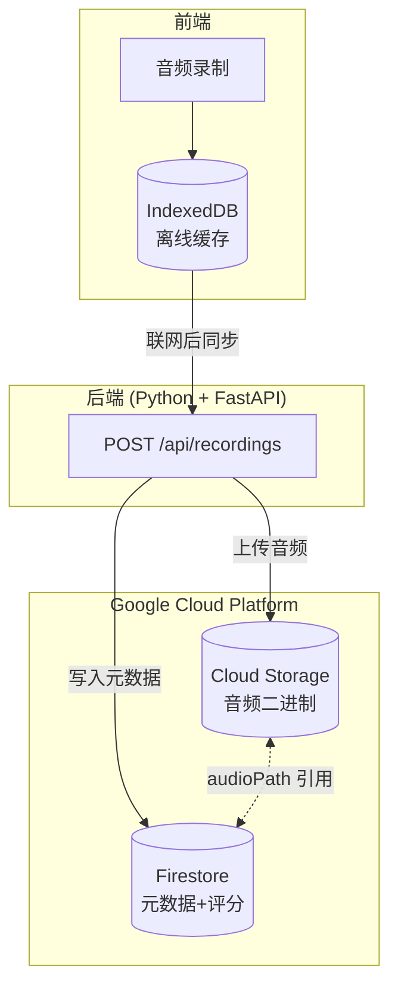
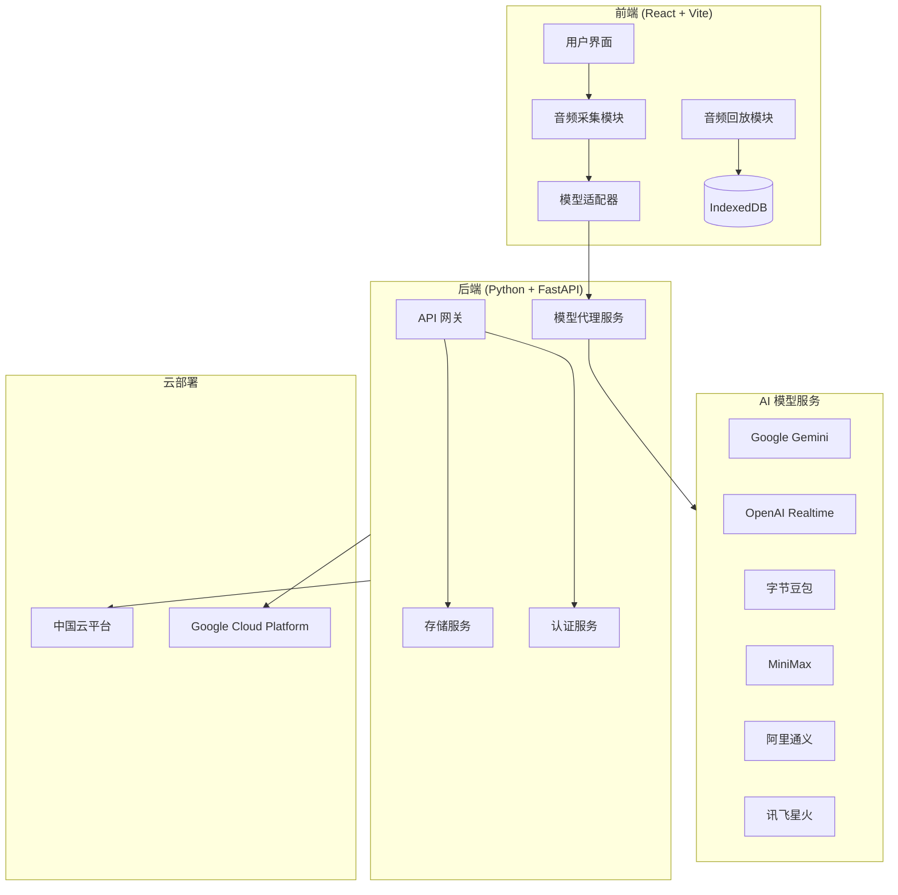
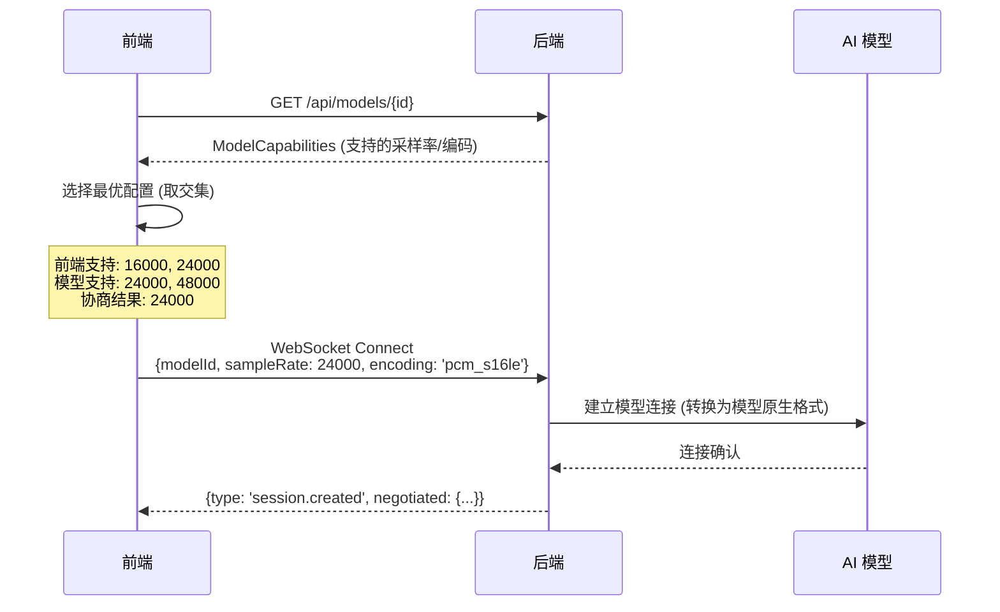
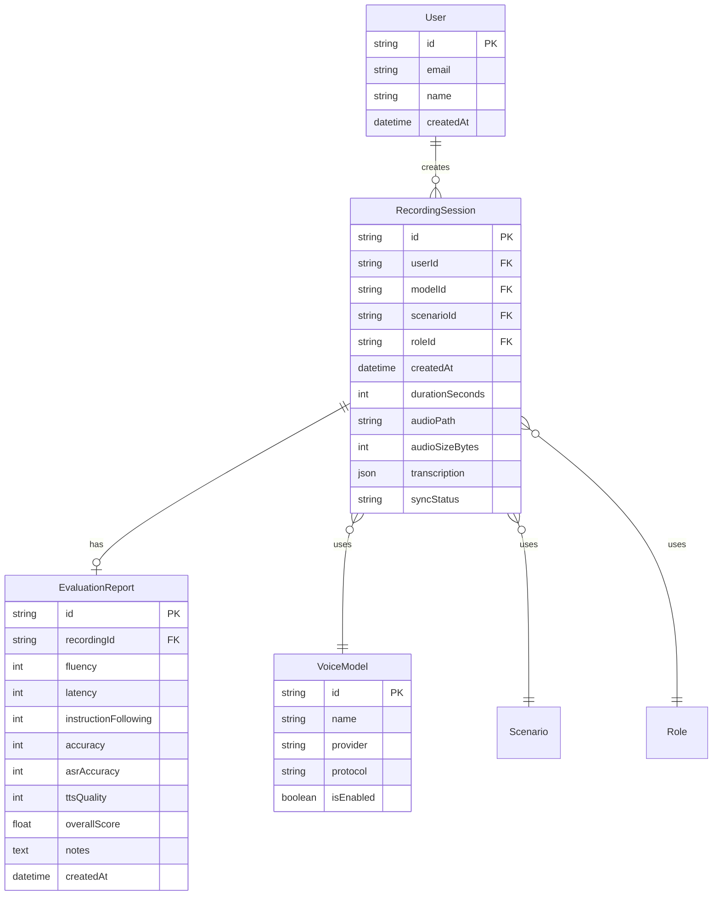

# 产品需求文档 (PRD)
# Voice Model Lab - 语音模型试验场

**文档版本**: v1.0  
**创建日期**: 2025-12-10  
**作者**: Antigravity AI  
**项目代号**: Quick Conversation Lab Extension

---

## 1. 项目概述

### 1.1 背景

当前的 `quick-conversation-lab` 应用是一个医药代表培训模拟器，使用 Google Gemini Native Audio 模型实现实时语音对话。随着市场上涌现出多种语音 AI 模型（国内外均有），用户希望能够在统一的业务场景下对比测试不同模型的实际表现。

### 1.2 产品定位

**Voice Model Lab (语音模型试验场)** 是一个在**医药代表对医生访谈**业务场景约束下的多模型语音对话测试平台。用户可以：

- 切换不同的 AI 语音模型
- 进行对话并录音保存
- 对每次对话进行手动评分
- 管理历史录音和评分记录

### 1.3 目标用户

- 医药培训团队的管理者
- AI 模型选型决策者
- 产品经理 / 技术评估人员

---

## 2. 功能需求

### 2.1 多模型接入

系统需要支持以下语音对话模型的接入：

#### 2.1.1 国际模型

| 模型 | 提供商 | 协议类型 | 特点 | 优先级 |
|------|--------|----------|------|--------|
| **Gemini Native Audio** | Google | WebSocket | 现有集成，低延迟 | ✅ 已完成 |
| **GPT-4o Realtime API** | OpenAI | WebSocket / WebRTC | 自然语音，可打断 | 🔴 高 |
| **Grok Voice** | xAI | REST + WebSocket | 多语言支持 | 🟡 中 |

#### 2.1.2 中国模型（推荐）

| 模型 | 提供商 | 协议类型 | 特点 | 优先级 |
|------|--------|----------|------|--------|
| **豆包实时语音** | 字节跳动 (火山引擎) | WebSocket | 端到端语音模型，延迟~700ms，真人级语音 | 🔴 高 |
| **MiniMax 实时交互 API** | MiniMax | HTTP + WebSocket | 超低延迟，丰富音色库 | 🔴 高 |
| **通义实时语音合成** | 阿里云 | WebSocket | 流式输入/输出，多语种方言 | 🟡 中 |
| **星火语音大模型** | 科大讯飞 | WebSocket | 202种方言，98%识别率 | 🟡 中 |
| **文心一言语音** | 百度 | REST + Streaming | 成熟稳定 | 🟢 低 |

> [!IMPORTANT]
> **推荐优先接入**：豆包（字节）和 MiniMax，它们的实时对话延迟最低，且有成熟的 WebSocket API。

---

### 2.2 模型切换功能

#### 2.2.1 界面需求

- 在会话开始前，用户可以从下拉列表中选择要使用的模型
- 显示每个模型的基本信息（名称、提供商、延迟预估、是否可用）
- 模型不可用时（如 API Key 未配置）显示禁用状态

#### 2.2.2 配置管理

- 每个模型需要独立的 API Key 配置入口
- 支持在设置页面统一管理所有模型的 API Key
- API Key 安全存储（前端环境变量 + 后端代理）

#### 2.2.3 参数分层设计原则

> [!IMPORTANT]
> **设计决策**：技术参数由后端统一管理，不在普通用户 UI 中暴露。

##### UI 层暴露的参数（用户可配置）

| 参数类型 | 示例 | 说明 |
|----------|------|------|
| **模型选择** | Gemini / OpenAI / 豆包 | 下拉选择 |
| **角色性格** | 敌对度、详细度、怀疑度 | 滑块 0-100 |
| **场景配置** | 知识库、对话流程、评分标准 | 文本编辑 |
| **语音风格** | 语速、语调（如模型支持） | 简化选项 |

##### 后端统一管理的参数（用户不可见）

| 参数类型 | 示例 | 管理方式 |
|----------|------|----------|
| **音频编码** | PCM / Opus / FLAC | Model Adapter 自动选择 |
| **采样率** | 16000 / 24000 / 48000 Hz | 根据模型能力自动协商 |
| **VAD 配置** | 静音检测阈值、超时时间 | 后端预设最优值 |
| **缓冲区大小** | 音频分片大小 | 后端根据网络状况调整 |
| **重试策略** | 断线重连、超时重试 | 后端统一处理 |

##### 设计理由

1. **用户体验**：普通用户不需要理解采样率、VAD 等技术概念
2. **一致性**：后端统一调优，避免前端参数配置不当导致的问题
3. **可维护性**：技术参数变更只需修改后端，无需发布前端版本
4. **模型差异封装**：不同模型的技术能力差异由 Adapter 内部处理

---

### 2.3 录音管理功能

#### 2.3.1 录音元数据

每条录音记录需要包含以下信息：

> [!NOTE]
> **数据模型分层**：前端使用 `RecordingSessionLocal`（含 Blob），后端/Firestore 使用 `RecordingSessionDoc`（只存 `audioPath`）。详见 Section 2.5.2。

**前端本地结构**（用于 IndexedDB 离线缓存）：

```typescript
interface RecordingSessionLocal {
  id: string;                    // 唯一标识
  createdAt: string;             // 录制时间 (ISO 8601)
  
  // 模型信息
  modelId: string;
  modelName: string;
  modelProvider: string;
  
  // 任务信息
  scenarioId: string;
  scenarioTitle: string;
  roleId: string;
  roleName: string;
  rolePersonality: {
    hostility: number;
    verbosity: number;
    skepticism: number;
  };
  
  // 录音数据 (仅前端本地)
  audioBlob: Blob;               // 音频二进制 (待上传到 GCS)
  audioMimeType: string;         // 'audio/webm;codecs=opus'
  duration: number;              // 时长（秒）
  transcription?: ChatMessage[];
  
  // 同步状态
  syncStatus: 'pending' | 'uploaded' | 'failed';
  evaluationId?: string;
}
```

#### 2.3.2 录音操作

| 功能 | 描述 |
|------|------|
| **自动录制** | 会话开始时自动开始录音 |
| **回放** | 点击录音条目可回放音频 |
| **删除** | 支持删除单条或批量删除 |
| **搜索/筛选** | 按模型、日期、场景筛选录音 |

> [!NOTE]
> 录音**不需要导出**功能，仅支持应用内回放。

---

#### 2.3.3 音频存储技术规范

##### 音频格式与压缩策略

| 参数 | 录制时（浏览器） | 存储时（GCS） | 回放时 |
|------|------------------|---------------|--------|
| **格式** | WebM 容器 (Opus 编码) | WebM (Opus) | WebM |
| **采样率** | 16000 Hz | 16000 Hz | 16000 Hz |
| **位深** | 16-bit | - | 16-bit |
| **声道** | Mono | Mono | Mono |
| **码率** | - | 24 kbps | - |

> [!NOTE]
> 实际实现中使用浏览器 MediaRecorder 直接录制 `audio/webm;codecs=opus`，后端仅做「容器透传 + 元数据记录」，不再进行二次编码。

**压缩比估算**：
- 原始 PCM：16000 × 16bit × 1ch = 256 kbps ≈ 1.92 MB/分钟
- WebM/Opus 压缩：24 kbps ≈ 180 KB/分钟
- **压缩率**：约 10:1

> [!TIP]
> 使用 Opus 编码可将 10 分钟对话从 ~19 MB 压缩到 ~1.8 MB。

##### 音频录制实现

```typescript
// services/audioRecorder.ts
interface AudioRecorderConfig {
  sampleRate: 16000 | 24000;
  channelCount: 1;
  enableCompression: boolean;
}

class AudioRecorder {
  private mediaRecorder: MediaRecorder | null = null;
  private chunks: Blob[] = [];
  
  async start(config: AudioRecorderConfig): Promise<void> {
    const stream = await navigator.mediaDevices.getUserMedia({
      audio: {
        sampleRate: config.sampleRate,
        channelCount: config.channelCount,
        echoCancellation: true,
        noiseSuppression: true
      }
    });
    
    // 优先使用 Opus 编码（如浏览器支持）
    const mimeType = MediaRecorder.isTypeSupported('audio/webm;codecs=opus')
      ? 'audio/webm;codecs=opus'
      : 'audio/webm';
    
    this.mediaRecorder = new MediaRecorder(stream, {
      mimeType,
      audioBitsPerSecond: 24000  // 24 kbps for Opus
    });
    
    this.mediaRecorder.ondataavailable = (e) => {
      if (e.data.size > 0) {
        this.chunks.push(e.data);
      }
    };
    
    // 每 5 秒分片，支持断点续存
    this.mediaRecorder.start(5000);
  }
  
  async stop(): Promise<Blob> {
    return new Promise((resolve) => {
      this.mediaRecorder!.onstop = () => {
        const blob = new Blob(this.chunks, { type: this.mediaRecorder!.mimeType });
        this.chunks = [];
        resolve(blob);
      };
      this.mediaRecorder!.stop();
    });
  }
}
```

---

### 2.4 用户评分报告

#### 2.4.1 评估维度（手动评分）

用户在每次对话结束后，需要对以下维度进行 1-5 星评分：

| 维度 | 英文标识 | 描述 | 评分标准 |
|------|----------|------|----------|
| **流畅度** | `fluency` | 对话是否连贯流畅？ | 1=频繁卡顿断句, 5=完全流畅 |
| **响应延迟** | `latency` | AI 回复的速度 | 1=>3秒, 2=2-3秒, 3=1-2秒, 4=500ms-1秒, 5=<500ms |
| **提示词遵循度** | `instruction_following` | 是否按设定的口气/性格说话？ | 1=完全不符, 5=完美匹配 |
| **内容准确性** | `accuracy` | 是否胡说八道/幻觉？ | 1=严重幻觉, 5=完全准确 |
| **语音识别准确率** | `asr_accuracy` | 对用户语音的识别是否正确？ | 1=大量识别错误, 5=识别准确 |
| **语音合成质量** | `tts_quality` | AI 的声音是否自然？ | 1=机械生硬, 5=自然真实 |

#### 2.4.2 评分报告结构

```typescript
interface EvaluationReport {
  id: string;                    // 评分报告ID
  recordingId: string;           // 关联的录音ID
  createdAt: string;             // 评分时间
  
  // 评分项
  scores: {
    fluency: number;             // 1-5
    latency: number;             // 1-5
    instructionFollowing: number; // 1-5
    accuracy: number;            // 1-5
    asrAccuracy: number;         // 1-5
    ttsQuality: number;          // 1-5
  };
  
  // 计算字段
  overallScore: number;          // 平均分
  
  // 用户备注
  notes?: string;                // 自由文本备注
}
```

#### 2.4.3 评分界面

- 会话结束后自动弹出评分界面
- 支持星级评分（可点击或滑动）
- 支持添加文字备注
- 评分完成后自动关联到对应录音

---

### 2.5 历史管理

#### 2.5.1 录音列表页

- 显示所有历史录音的卡片列表
- 每张卡片显示：模型名称、场景、时长、日期、评分概览
- 支持按模型/日期/评分筛选
- 点击卡片可展开详情并回放

#### 2.5.2 数据存储架构

##### 存储方案选型

> [!IMPORTANT]
> **最终方案**：采用 **Cloud Storage (GCS) + Firestore** 分离存储，而非纯前端 IndexedDB。
> 
> **理由**：
> - 音频文件较大（~2 MB/分钟），IndexedDB 有浏览器配额限制（~500 MB）
> - 需要支持跨设备同步和团队协作
> - 后续可直接从 GCS 读取音频做 ASR/TTS 分析

##### 存储分层设计



| 存储层 | 用途 | 技术方案 | 内容 |
|--------|------|----------|------|
| **L1: IndexedDB** | 离线缓存 | 浏览器本地 | 未同步的录音 Blob |
| **L2: Cloud Storage** | 音频存储 | GCS / 阿里云 OSS | `gs://bucket/recordings/{userId}/{sessionId}.webm` |
| **L3: Firestore** | 元数据 + 评分 | NoSQL 文档 | `recordingSessions`, `evaluationReports` |

##### Cloud Storage 设计

**Bucket 结构**：

```
gs://voice-model-lab/
├── recordings/
│   ├── {userId}/
│   │   ├── {sessionId}.webm          # 对话录音
│   │   └── {sessionId}.webm.meta     # 可选：音频元信息
│   └── ...
└── transcripts/
    └── {userId}/
        └── {sessionId}.json          # 对话转写文本
```

**音频格式**：

| 参数 | 值 | 说明 |
|------|-----|------|
| 容器格式 | WebM | 浏览器原生支持录制 |
| 编码 | Opus | 高压缩率，~24 kbps |
| 备选格式 | FLAC | 无损，用于后续 ASR 分析 |

**Lifecycle Policy（自动过期）**：

```json
{
  "rule": [{
    "action": { "type": "Delete" },
    "condition": {
      "age": 90,
      "matchesPrefix": ["recordings/"]
    }
  }]
}
```

> [!NOTE]
> 默认 90 天后自动删除音频文件，可通过后台配置调整。

##### Firestore Schema 设计

**Collection: `recordingSessions`**

```typescript
// Firestore Document: recordingSessions/{sessionId}
interface RecordingSessionDoc {
  // 主键 (自动生成)
  id: string;
  
  // 用户
  userId: string;
  
  // 时间
  createdAt: Timestamp;
  updatedAt: Timestamp;
  
  // 模型信息
  modelId: string;
  modelName: string;
  modelProvider: string;
  
  // 场景信息
  scenarioId: string;
  scenarioTitle: string;
  roleId: string;
  roleName: string;
  rolePersonality: {
    hostility: number;
    verbosity: number;
    skepticism: number;
  };
  
  // 录音信息
  durationSeconds: number;
  audioSizeBytes: number;
  audioPath: string;        // GCS 路径: gs://bucket/recordings/{userId}/{sessionId}.webm
  audioMimeType: string;    // 'audio/webm;codecs=opus'
  
  // 转写
  transcription: {
    role: 'user' | 'model';
    text: string;
    timestamp: number;
  }[];
  
  // 关联
  evaluationId?: string;
  
  // 状态
  syncStatus: 'pending' | 'uploaded' | 'failed';
}
```

**Collection: `evaluationReports`**

```typescript
// Firestore Document: evaluationReports/{evaluationId}
interface EvaluationReportDoc {
  id: string;
  recordingId: string;       // 关联的录音 ID
  userId: string;
  createdAt: Timestamp;
  
  // 评分
  scores: {
    fluency: number;
    latency: number;
    instructionFollowing: number;
    accuracy: number;
    asrAccuracy: number;
    ttsQuality: number;
  };
  
  overallScore: number;
  notes?: string;
}
```

**索引设计**：

```javascript
// firestore.indexes.json
{
  "indexes": [
    {
      "collectionGroup": "recordingSessions",
      "queryScope": "COLLECTION",
      "fields": [
        { "fieldPath": "userId", "order": "ASCENDING" },
        { "fieldPath": "createdAt", "order": "DESCENDING" }
      ]
    },
    {
      "collectionGroup": "recordingSessions",
      "queryScope": "COLLECTION",
      "fields": [
        { "fieldPath": "userId", "order": "ASCENDING" },
        { "fieldPath": "modelId", "order": "ASCENDING" },
        { "fieldPath": "createdAt", "order": "DESCENDING" }
      ]
    }
  ]
}
```

##### 离线同步机制

```typescript
// services/syncManager.ts
class SyncManager {
  private db: IDBDatabase;  // IndexedDB for offline cache
  
  /**
   * 录音结束后调用，先存本地，再尝试上传
   */
  async saveRecording(session: RecordingSession): Promise<void> {
    // 1. 先存入 IndexedDB (离线支持)
    await this.db.put('pendingUploads', {
      id: session.id,
      audioBlob: session.audioBlob,
      metadata: session.metadata,
      status: 'pending',
      retryCount: 0
    });
    
    // 2. 尝试上传到云端
    await this.syncToCloud(session.id);
  }
  
  /**
   * 上传到云端
   */
  async syncToCloud(sessionId: string): Promise<void> {
    const pending = await this.db.get('pendingUploads', sessionId);
    if (!pending) return;
    
    try {
      // 获取上传 URL (Signed URL)
      const { uploadUrl, audioPath } = await fetch('/api/recordings/upload-url', {
        method: 'POST',
        body: JSON.stringify({ sessionId, mimeType: pending.metadata.mimeType })
      }).then(r => r.json());
      
      // 上传音频到 GCS
      await fetch(uploadUrl, {
        method: 'PUT',
        body: pending.audioBlob,
        headers: { 'Content-Type': pending.metadata.mimeType }
      });
      
      // 写入 Firestore 元数据
      await fetch('/api/recordings', {
        method: 'POST',
        body: JSON.stringify({
          ...pending.metadata,
          audioPath,
          syncStatus: 'uploaded'
        })
      });
      
      // 删除本地缓存
      await this.db.delete('pendingUploads', sessionId);
      
    } catch (error) {
      // 上传失败，标记待重试
      await this.db.put('pendingUploads', {
        ...pending,
        status: 'failed',
        retryCount: pending.retryCount + 1,
        lastError: error.message
      });
    }
  }
  
  /**
   * 应用启动时检查并同步未上传的录音
   */
  async syncPendingUploads(): Promise<void> {
    const pending = await this.db.getAll('pendingUploads');
    for (const item of pending) {
      if (item.retryCount < 3) {
        await this.syncToCloud(item.id);
      }
    }
  }
}
```

##### 中国区存储方案

| 组件 | GCP (海外) | 阿里云 (中国) |
|------|------------|---------------|
| 音频存储 | Cloud Storage | OSS |
| 元数据 | Firestore | 表格存储 (Tablestore) |
| Bucket 路径 | `gs://voice-model-lab/` | `oss://voice-model-lab-cn/` |

> [!TIP]
> 后端根据用户区域自动切换存储端点，前端无需感知。

---


## 3. 技术架构

### 3.0 现有技术栈评估

#### 3.0.1 当前技术栈

| 类别 | 技术 | 版本 | 状态 |
|------|------|------|------|
| **语言** | TypeScript | 5.8.2 | ✅ 保留 |
| **前端框架** | React | 19.2.0 | ✅ 保留 |
| **构建工具** | Vite | 6.2.0 | ✅ 保留 |
| **UI 图标** | Lucide React | 0.555.0 | ✅ 保留 |
| **AI SDK** | @google/genai | 1.30.0 | ✅ 保留 |
| **PDF 解析** | pdfjs-dist | 4.0.379 | ✅ 保留 |
| **样式** | Tailwind CSS | - | ✅ 保留 |
| **后端** | ❌ 无 | - | 🔴 需新增 |
| **数据库** | LocalStorage | - | ⚠️ 需增强 |

#### 3.0.2 需求满足度评估

| 需求 | 当前状态 | 评估 |
|------|----------|------|
| TypeScript 开发 | ✅ 已配置 | 完全满足 |
| React UI 开发 | ✅ 已实现 | 完全满足 |
| WebSocket 音频流 | ✅ 浏览器原生 | 可满足 |
| 音频录制/播放 | ✅ Web Audio API | 可满足 |
| 多模型适配器 | ⚠️ 仅 Gemini | 需重构 |
| IndexedDB 存储 | ❌ 未使用 | 需添加 |
| 后端代理服务 | ❌ 无后端 | **需新建** |
| API Key 安全管理 | ⚠️ 前端明文 | 需迁移到后端 |

---

### 3.0.3 后端技术选型：Python + FastAPI

#### 选型对比

| 维度 | Node.js + Express | Python + FastAPI | 胜出 |
|------|-------------------|------------------|------|
| **WebSocket 支持** | 原生强大 | 支持良好 | 🟡 平手 |
| **中国模型 SDK** | 部分有，需封装 | **官方 SDK 完善** | 🐍 Python |
| **OpenAI SDK** | 官方支持 | **官方支持更成熟** | 🐍 Python |
| **与前端统一语言** | ✅ TypeScript | 需切换语境 | 🟢 Node |
| **AI/ML 生态** | 较弱 | **非常强大** | 🐍 Python |
| **阿里云/火山引擎支持** | 一般 | **更好** | 🐍 Python |
| **开发效率** | 需更多配置 | **极简高效** | 🐍 Python |

#### 中国模型 SDK 支持情况

| 模型 | Python SDK | Node.js SDK |
|------|------------|-------------|
| **字节豆包** (火山引擎) | ✅ 官方 `volcengine-python-sdk` | ⚠️ 需自行封装 |
| **MiniMax** | ✅ 官方 SDK | ⚠️ 无官方 |
| **阿里通义** | ✅ 官方 `dashscope` | ⚠️ 部分支持 |
| **讯飞星火** | ✅ 官方 SDK | ⚠️ 需自行封装 |
| **OpenAI** | ✅ 官方 `openai` | ✅ 官方 `openai` |

> [!IMPORTANT]
> **最终选型：Python + FastAPI**
> 
> 理由：中国语音模型大多只提供 Python 官方 SDK，使用 Python 可以直接调用官方库，减少封装工作量和兼容性风险。

#### 后端技术栈

```python
# requirements.txt
fastapi>=0.115
uvicorn>=0.32
websockets>=12.0
python-dotenv>=1.0

# AI 模型 SDK
openai>=1.50              # OpenAI Realtime API
dashscope>=1.20           # 阿里通义
volcengine-python-sdk     # 字节豆包
# minimax-sdk             # MiniMax (或自行封装)
# xfyun-sdk               # 讯飞星火
```

---

### 3.0.4 最小前端改动策略

#### 核心原则

**后端作为"透明代理"**：保持前端现有的 WebSocket 消息格式不变，由后端负责协议转换。

```
现有架构:
前端 ──WebSocket──> Google Gemini API (直连)

目标架构:
前端 ──WebSocket──> Python 后端 ──WebSocket──> 各种模型 API
           │
           └── 复用现有 WebSocket 消息格式
```

#### 前端改动清单（仅 ~5 行代码）

| 文件 | 改动内容 | 代码行数 |
|------|----------|----------|
| `GeminiSocket.ts` → `VoiceSocket.ts` | 修改 WebSocket URL | 1 行 |
| `useSessionConnection.ts` | 传入 `modelId` 参数 | 2-3 行 |
| `vite.config.ts` | 添加 `BACKEND_WS_HOST` 环境变量 | 1 行 |
| 新增 `ModelSelector` 组件 | UI 选择模型下拉框 | 新增文件 |

#### 核心改动示例

```typescript
// 改动前 (GeminiSocket.ts 第 18-19 行)
const host = "generativelanguage.googleapis.com";
this.url = `wss://${host}/ws/google.ai.generativelanguage.v1alpha...?key=${apiKey}`;

// 改动后 (重命名为 VoiceSocket.ts)
const backendHost = process.env.BACKEND_WS_HOST || "localhost:8000";
this.url = `wss://${backendHost}/ws/${modelId}`;
// API Key 不再从前端传递，由后端管理
```

#### 消息格式兼容性

前端发送的消息格式保持不变，后端负责转换：

```
前端发送 (格式不变):
{
  "setup": { "model": "...", "system_instruction": {...} },
  "realtime_input": { "media_chunks": [...] }
}
        │
        ▼
Python 后端 ModelAdapter 转换层
        │
        ▼
转换为各模型的原生格式发送
```

#### 保持不变的组件

| 组件 | 说明 |
|------|------|
| `AudioStreamer.ts` | 音频采集模块，完全不变 |
| `WaveformCanvas.tsx` | 波形可视化，完全不变 |
| `ConfigPanel.tsx` | 会话配置面板，完全不变 |
| `SessionDebugConsole.tsx` | 调试控制台，完全不变 |
| 所有 UI 组件 | 样式和交互逻辑不变 |

---

### 3.1 系统架构图



### 3.2 模型适配器设计

为了统一不同模型的接口差异，设计一个 **Model Adapter** 抽象层：

```typescript
interface VoiceModelAdapter {
  // 模型标识
  readonly id: string;
  readonly name: string;
  readonly provider: string;
  
  // 生命周期
  connect(config: SessionConfig): Promise<void>;
  disconnect(): Promise<void>;
  
  // 音频流
  sendAudioChunk(base64Pcm: string): void;
  onAudioReceived: (callback: (base64Pcm: string) => void) => void;
  
  // 转写
  onTranscription: (callback: (role: 'user' | 'model', text: string) => void) => void;
  
  // 状态
  getStatus(): 'disconnected' | 'connecting' | 'connected' | 'error';
}
```

---

### 3.3 前端迁移路径详细设计

#### 3.3.1 现有代码耦合点分析

| 文件 | 耦合内容 | 迁移方案 |
|------|----------|----------|
| `GeminiSocket.ts` | 硬编码 Gemini WebSocket URL | 抽象为 `VoiceSocket.ts`，URL 从后端配置获取 |
| `useSessionConnection.ts` | 直接实例化 `GeminiSocket` | 改为工厂模式，根据 `modelId` 创建连接 |
| `ConfigPanel.tsx` | 固定的 Gemini 语音配置（Kore/Puck 等） | 从后端动态获取模型支持的语音列表 |
| `constants.ts` | `AVAILABLE_VOICES` 硬编码 | 迁移为 API 动态获取 `GET /api/models/{id}/voices` |

#### 3.3.2 模型配置动态获取

前端启动时从后端获取可用模型列表和配置：

```typescript
// 新增: services/modelService.ts
interface ModelCapabilities {
  id: string;
  name: string;
  provider: string;
  isEnabled: boolean;
  
  // 音频配置
  supportedSampleRates: number[];      // [16000, 24000, 48000]
  supportedEncodings: string[];        // ['pcm_s16le', 'opus']
  defaultSampleRate: number;
  defaultEncoding: string;
  
  // 语音配置
  availableVoices: VoiceConfig[];
  defaultVoice: string;
  
  // 能力标记
  supportsTranscription: boolean;
  supportsInterruption: boolean;
  maxSessionDuration: number;          // 秒
}

// API 调用
const models = await fetch('/api/models').then(r => r.json());
const modelConfig = await fetch(`/api/models/${modelId}`).then(r => r.json());
```

#### 3.3.3 采样率/编码协商机制



---

### 3.4 后端 WebSocket 协议规范

#### 3.4.1 连接端点

```
wss://{backend_host}/ws/{model_id}
```

#### 3.4.2 统一消息格式

所有消息使用 JSON 格式，包含以下字段：

```typescript
interface WebSocketMessage {
  type: string;           // 消息类型
  timestamp: number;      // 时间戳 (Unix ms)
  requestId?: string;     // 请求关联 ID（可选）
  payload: object;        // 消息体
}
```

#### 3.4.3 握手协议（Handshake）

**客户端 → 服务端：`session.create`**

```json
{
  "type": "session.create",
  "timestamp": 1702200000000,
  "requestId": "req-001",
  "payload": {
    "modelId": "gemini",
    "audio": {
      "sampleRate": 16000,
      "encoding": "pcm_s16le",
      "channels": 1
    },
    "voice": {
      "voiceId": "Kore",
      "language": "zh-CN"
    },
    "session": {
      "systemInstruction": "You are Dr. Zhang...",
      "maxDuration": 600
    }
  }
}
```

**服务端 → 客户端：`session.created`**

```json
{
  "type": "session.created",
  "timestamp": 1702200000100,
  "requestId": "req-001",
  "payload": {
    "sessionId": "sess-abc123",
    "negotiated": {
      "sampleRate": 16000,
      "encoding": "pcm_s16le",
      "voiceId": "Kore"
    },
    "capabilities": {
      "transcription": true,
      "interruption": true
    }
  }
}
```

#### 3.4.4 心跳机制（Heartbeat）

**客户端 → 服务端：`ping`**（每 15 秒发送）

```json
{
  "type": "ping",
  "timestamp": 1702200015000
}
```

**服务端 → 客户端：`pong`**

```json
{
  "type": "pong",
  "timestamp": 1702200015050
}
```

> [!WARNING]
> 如果 30 秒内未收到 `pong`，前端应触发自动重连逻辑。

#### 3.4.5 音频数据传输

**客户端 → 服务端：`audio.input`**

```json
{
  "type": "audio.input",
  "timestamp": 1702200001000,
  "payload": {
    "data": "base64_encoded_pcm_data...",
    "sequence": 42
  }
}
```

**服务端 → 客户端：`audio.output`**

```json
{
  "type": "audio.output",
  "timestamp": 1702200001200,
  "payload": {
    "data": "base64_encoded_pcm_data...",
    "sequence": 15,
    "isFinal": false
  }
}
```

#### 3.4.6 转写消息

**服务端 → 客户端：`transcription`**

```json
{
  "type": "transcription",
  "timestamp": 1702200002000,
  "payload": {
    "role": "user",
    "text": "您好，我想了解一下达芙通的适应症。",
    "isFinal": true
  }
}
```

#### 3.4.7 会话控制

**服务端 → 客户端：`turn.complete`**

```json
{
  "type": "turn.complete",
  "timestamp": 1702200010000,
  "payload": {
    "turnId": "turn-005"
  }
}
```

**客户端 → 服务端：`session.end`**

```json
{
  "type": "session.end",
  "timestamp": 1702200600000,
  "payload": {
    "reason": "user_initiated"
  }
}
```

#### 3.4.8 错误码定义

| 错误码 | 名称 | 描述 | 客户端处理 |
|--------|------|------|------------|
| `1000` | `NORMAL_CLOSURE` | 正常关闭 | 无需处理 |
| `4001` | `AUTH_FAILED` | API Key 无效或过期 | 提示用户检查配置 |
| `4002` | `MODEL_UNAVAILABLE` | 模型服务不可用 | 提示选择其他模型 |
| `4003` | `RATE_LIMITED` | 请求过于频繁 | 等待后重试 |
| `4004` | `QUOTA_EXCEEDED` | 配额用尽 | 提示用户充值/升级 |
| `4005` | `SESSION_TIMEOUT` | 会话超时 | 自动重连 |
| `4006` | `AUDIO_FORMAT_ERROR` | 音频格式不支持 | 检查采样率/编码 |
| `4100` | `UPSTREAM_ERROR` | 上游模型错误 | 显示错误详情 |

**错误消息格式**：

```json
{
  "type": "error",
  "timestamp": 1702200005000,
  "payload": {
    "code": 4002,
    "message": "Model 'grok' is currently unavailable",
    "details": {
      "retryAfter": 300,
      "fallbackModels": ["gemini", "openai"]
    }
  }
}
```

---

### 3.5 后端 ModelAdapter 实现

#### 3.5.1 Python 抽象基类

```python
# adapters/base.py
from abc import ABC, abstractmethod
from dataclasses import dataclass
from typing import Callable, Optional

@dataclass
class AudioConfig:
    sample_rate: int = 16000
    encoding: str = "pcm_s16le"
    channels: int = 1

@dataclass
class SessionConfig:
    model_id: str
    audio: AudioConfig
    voice_id: str
    system_instruction: str
    max_duration: int = 600

class BaseModelAdapter(ABC):
    """所有模型适配器的抽象基类"""
    
    @property
    @abstractmethod
    def id(self) -> str: ...
    
    @property
    @abstractmethod
    def name(self) -> str: ...
    
    @property
    @abstractmethod
    def supported_sample_rates(self) -> list[int]: ...
    
    @abstractmethod
    async def connect(self, config: SessionConfig) -> None: ...
    
    @abstractmethod
    async def disconnect(self) -> None: ...
    
    @abstractmethod
    async def send_audio(self, audio_base64: str, sequence: int) -> None: ...
    
    @abstractmethod
    def on_audio_received(self, callback: Callable[[str, int, bool], None]) -> None: ...
    
    @abstractmethod
    def on_transcription(self, callback: Callable[[str, str, bool], None]) -> None: ...
```

#### 3.5.2 Gemini 适配器示例

```python
# adapters/gemini_adapter.py
class GeminiAdapter(BaseModelAdapter):
    id = "gemini"
    name = "Gemini Native Audio"
    supported_sample_rates = [16000, 24000]
    
    async def connect(self, config: SessionConfig) -> None:
        # 转换为 Gemini 原生格式
        gemini_setup = {
            "setup": {
                "model": "models/gemini-2.5-flash-native-audio-preview-09-2025",
                "generation_config": {
                    "response_modalities": ["AUDIO"],
                    "speech_config": {
                        "voice_config": {
                            "prebuilt_voice_config": {
                                "voice_name": config.voice_id
                            }
                        }
                    }
                },
                "system_instruction": {
                    "parts": [{"text": config.system_instruction}]
                }
            }
        }
        await self._ws.send(json.dumps(gemini_setup))
    
    async def send_audio(self, audio_base64: str, sequence: int) -> None:
        # 转换为 Gemini realtime_input 格式
        msg = {
            "realtime_input": {
                "media_chunks": [{
                    "mime_type": "audio/pcm",
                    "data": audio_base64
                }]
            }
        }
        await self._ws.send(json.dumps(msg))
```

---


## 4. 部署方案

### 4.1 双云部署架构

| 部署环境 | 云平台 | 用途 | 访问区域 |
|----------|--------|------|----------|
| **国际版** | Google Cloud Platform (GCP) | 访问 Google/OpenAI/Grok | 海外用户 |
| **中国版** | 阿里云 / 腾讯云 / 火山引擎 | 访问中国模型 | 中国大陆用户 |

### 4.2 GCP 部署

| 组件 | GCP 服务 | 说明 |
|------|----------|------|
| 前端托管 | Firebase Hosting | 静态网站托管 |
| 后端 API | Cloud Run | 无服务器容器 |
| 数据库 | Firestore | NoSQL 文档数据库 |
| 音频存储 | Cloud Storage | 大文件存储 |
| 认证 | Firebase Auth | 用户认证 |

### 4.3 中国云部署（推荐：阿里云或火山引擎）

| 组件 | 阿里云服务 | 火山引擎服务 | 说明 |
|------|------------|--------------|------|
| 前端托管 | OSS + CDN | veImageX + CDN | 静态资源 |
| 后端 API | 函数计算 FC | veFaaS | Serverless |
| 数据库 | 表格存储 / RDS | veDB | 数据持久化 |
| 音频存储 | OSS | TOS (对象存储) | 音频文件 |

> [!TIP]
> **推荐使用火山引擎**：因为豆包模型是字节跳动产品，使用火山引擎可以获得更好的网络延迟和服务集成。

### 4.4 域名与路由

```
app.example.com  ──┬──> global.example.com (GCP)     ← 海外用户
                   └──> cn.example.com    (阿里云)   ← 中国大陆用户

通过 DNS 地理位置路由或前端检测自动切换
```

---

## 5. 数据模型

### 5.1 核心实体



---

## 6. 开发里程碑

### Phase 1: 基础架构 (2 周)

- [ ] 设计并实现 VoiceModelAdapter 抽象层
- [ ] 重构现有 Gemini 集成为 Adapter 模式
- [ ] 实现模型切换 UI
- [ ] 实现录音保存功能 (IndexedDB 离线缓存 + GCS 云端存储)

### Phase 2: 国际模型接入 (2 周)

- [ ] 接入 OpenAI Realtime API (GPT-4o)
- [ ] 接入 Grok Voice API
- [ ] 实现后端 WebSocket 代理服务

### Phase 3: 中国模型接入 (3 周)

- [ ] 接入 字节豆包 实时语音
- [ ] 接入 MiniMax 实时交互 API
- [ ] 接入 阿里通义 实时语音
- [ ] 接入 讯飞星火 语音大模型

### Phase 4: 评分与管理功能 (2 周)

- [ ] 实现评分弹窗 UI
- [ ] 实现评分报告数据结构
- [ ] 实现录音历史列表页
- [ ] 实现录音回放功能

### Phase 5: 部署上线 (1 周)

- [ ] 部署 GCP 环境
- [ ] 部署中国云环境
- [ ] 配置 CI/CD 流水线
- [ ] 域名与 SSL 配置

---

## 7. 风险与注意事项

| 风险 | 影响 | 缓解措施 |
|------|------|----------|
| 模型 API 不稳定 | 对话中断 | 实现自动重连 + 降级方案 |
| 中国模型访问延迟 | 用户体验差 | 使用中国云部署 |
| API Key 泄露 | 安全风险 | 所有密钥通过后端代理 |
| 录音存储空间 | 成本上升 | 设置单用户配额 + 自动清理 |
| 不同模型的音频格式不兼容 | 处理复杂 | 在适配器层统一转换 |

---

## 8. 附录

### 8.1 中国语音模型 API 文档链接

| 模型 | 官方文档 |
|------|----------|
| 豆包 (字节) | https://www.volcengine.com/docs/6561 |
| MiniMax | https://www.minimaxi.com/document/guides |
| 通义 (阿里) | https://help.aliyun.com/zh/dashscope |
| 星火 (讯飞) | https://www.xfyun.cn/doc/spark |

### 8.2 国际模型 API 文档链接

| 模型 | 官方文档 |
|------|----------|
| Gemini | https://ai.google.dev/gemini-api/docs |
| OpenAI Realtime | https://platform.openai.com/docs/api-reference/realtime |
| Grok | https://docs.x.ai/docs |

---

**文档结束**
